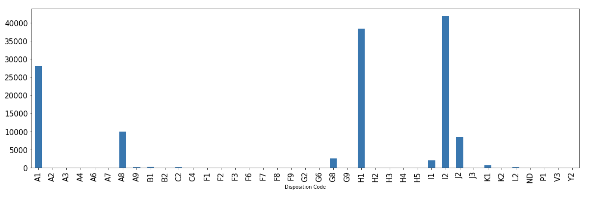
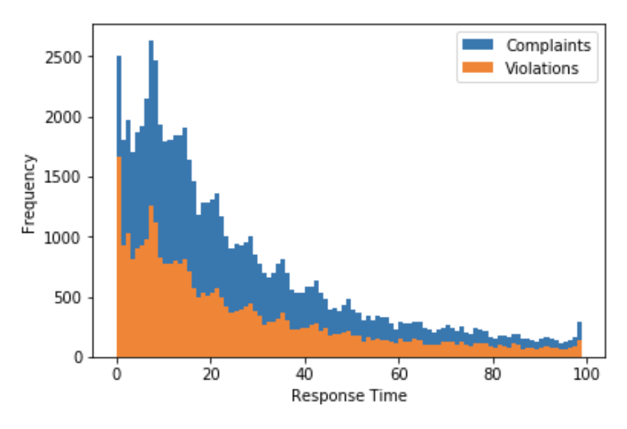
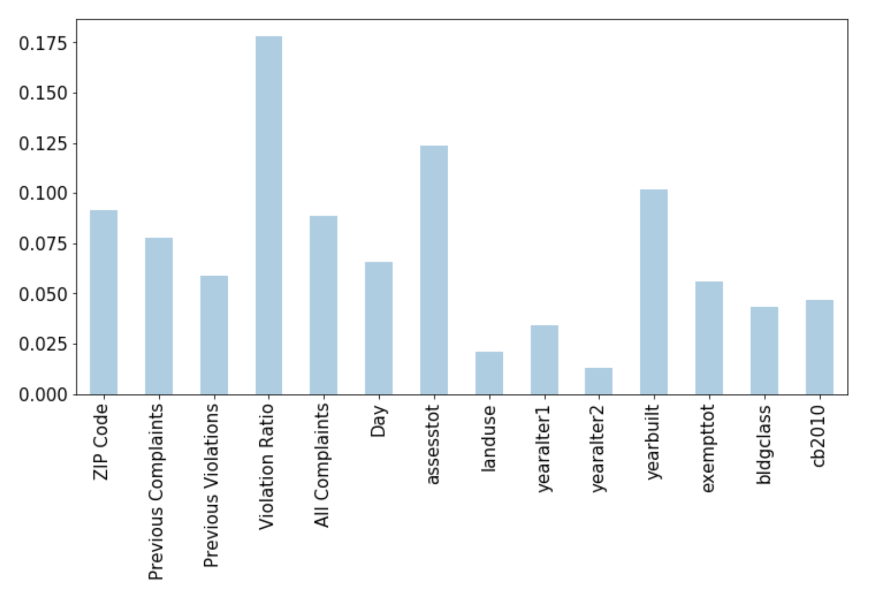

# NYC DOB Elevator Violation Classification Project
This project evaluates the effectiveness of NYC's Department of Buildings ordering of 311 elevator inspections. 

Check out my code in `DOB_elevator_complaints_model.ipynb`

## Background
In January 2019 I read [this](https://therealdeal.com/issues_articles/elevator-accidents-new-york-city/) article by Kathryn Brenzel and David Jeans about elevator accidents in New York City and it freaked me out!  The article outlined a number inefficiencies and problems with the current methods elevators are inspected and fixed.  For example, New York state does not require elevator mechanics to be licensed... yikes!

Something that stood out to me was the sheer number of elevators in NYC that need to be inspected by the DOB and third party inspectors.  The large number of elevators and inefficient inspections result in problems. Brenzel and Jeans found: "A report released in June by state Comptroller Thomas DiNapoli found that 14,828 mandated inspections were not conducted by DOB-hired inspectors between 2015 and 2016."  While 40% of these elevator were not inspected because the inspectors could not get into the building, what happened with the other 60% of these elevators?!  

Right around this time I was going down my elevator rapid hole, I went to NYC school of data and learned about The Mayor's Office of Analyics's (MODA) work. MODA worked with DOB to increase the efficiency of building inspectors by intelligently prioritizing complaints that result in illegal conversion violations. The project's problem statement is: "The main challenge is identifying which complaints to prioritize given the limited number of inspectors." [Here](https://moda-nyc.github.io/Project-Library/projects/illegal-conversions/) is a link to the project. MODA assembled relevant building features and was able to successfully classify 311 complaints as violations and non violations using a Random Forest Classifier.  They piloted their model in Queens which resulted in illegal conversions being responded to faster. 

This got me thinking ... could I do the same thing for ... Elevators???

## Problem Statement
(Variation on MODA's Illegal Conversion Problem Statement)
 
The purpose of this project is to use DOB inspection and violation data to perform an analysis of historical outcomes, find common traits of buildings that have elevator violations, and use that data to risk-analyse new complaints to prioritize future inspections.

## Dataset
I analyzed elevator complaints in the [DOB Complaints Received](https://data.cityofnewyork.us/Housing-Development/DOB-Complaints-Received/eabe-havv) dataset. The dataset is updated daily with all building complaints and contains records back to 1989. It contains fields such as 'Date Entered', 'Date Inspected', 'BIN', and 'Complaint Category'.

I began my analysis by filtering down to just elevator complaints.  There are five different types of elevator complaints but I focused on complaint category 63 (Elevator-Danger Condition/Shaft Open/Unguarded) B because it is the vast majority of elevator complaints (93%) and simplifies the problem.  

Next, I determined whether or not the complaint resulted in a violation using 'Disposition Code'. Here is a bar graph of the disposition codes.

**Result in Violation**: A8 (ECB Violation Served), A1 (Buildings Violation(s) Served)

**DID NOT result in Violation**: I2 (No Violation Warranted for Complaint at Time of Inspection), I1 (Complaint Unsubstantiated Based on Department Records), 

**Note**: H1 (Please See Complaint Number) No documentation as to what this means. J2 (J1?: Follow-Up Inspection to be Scheduled Upon Further Research) No documentation for 'J2' so it is most likely J1.

## Analysis
My main question for this project was: how effective is the DOB at prioritizing complaints that result in violations?  To answer this question I began by calculating the 'Response Time' for each complaint.  Response time is the time between the date the complaint was made and the date the complaint was inspected. To get a general understanding of how effective the DOB's inspection ordering was, I plotted a histogram of Response Time for all complaints and complaints that resulted in a violation:

The ratio of violations to complaints responded within the first day suggests that the DOB has some method of somewhat effectively prioritizing complaints.  For most response time bins, the ratio of violations to complaints is mostly the same.  Ideally the number of complaints that result in a violation should have lower response times than the complaints that do not result in complaints. 

## Evaluation Metric
I implemented an evaluation metric called priority score that measures how an ordering of complaints for a given day compares to the  optimal  ordering.   The  optimal  ordering  being  all  of  the  complaints  resulting  in violations positioned first in the order and all of the complaints not resulting in violations positioned last.  The final score is an average accuracy for complaints resulting in violations and complaints not resulting in violations amongst all days.  The higher the the accuracy,  the faster the DOB can address complaints that result in violations.  Priority score is nice because it accounts for the fluctuations of number of complaints on a given day.

I calculated the priority score for the DOB's daily ordering, a random ordering and the perfect ordering (as a sanity check).  To calculate the DOB's priority score, I assumed the response time for complaints on a given day to be the priority of the complaints.  These are the results:

**Sanity Check: Perfect Accuracy (Rank by the label)**

Average Violation Accuracy: 1.0

Average No Violation Accuracy: 1.0

**Random Ordering**

Average Violation Accuracy: 0.51

Average No Violation Accuracy: 0.56

**Baseline (DOB Ordering)**

Average Violation Accuracy: 0.52

Average No Violation Accuracy: 0.57

The DOB ordering was slightly better than the random ordering.  This confirms the idea that the DOB has some intuition into which complaints to prioritize.  

## Can we do a better job prioritizing complaints?
To improve on the ordering of inspection on a given day, I first calculated the number of previous complaints and violations associated with the building of a given complaint.  I also calculated the ratio of previous violations to previous complaints.  I calculated the priority score ordering the complaints using these three metrics and found the violation ratio to be the most effective. 

**Prioritize based on violation ratio history**

Average Violation Accuracy: 0.58

Average No Violation Accuracy: 0.62

Prioritizing complaints based on violation ratio history results in a 5 and 6 point increase in average violation accuracy and average no-violation accuracy respectively. This is a noticeable increase in efficiency for inspectors but can we do better? To answer this question, I trained a Random Tree classifier on violation history and building features from the NYC PLUTO dataset to try to increase the priority score. 

## Model

I began the feature selection process by creating a mapping from Building Index Number (BIN) to Borough Block Lot number (BBL) in order to merge PLUTO and the DOB complaints dataset. There can be multiple BINs for a BBL. 

I then created train, val and test splits, ensuring that complaints with the same BIN were in the same split so that the model would not memorize buildings' features. Once the splits were created, I trained a Random Forest Model and did a simple hyper parameter search on max depth of the trees. The model's training accuracy was 77% and the validation accuracy as 60%. Once the model was tuned, I evaluated the model on the test set. The testing accuracy was also 60% which means the model was able to generalize to different data. I also, plotted the feature importances for the classifier:

The most important feature for making classifications was violation ratio. Assessed value total of the building lot and the year built were also import features.  

While the validation and testing accuracy have room for improvement, the model did show slight improvement in priority score on the test set. For a given day, I ordered complaints based on the probability of prediction values. Here are the priority scores on the test set: 

**Random** 
Average True positive Accuracy: 0.70

Average True Negative Accuracy: 0.74

**Baseline (DOB Ordering)** 
Average True positive Accuracy: 0.70

Average True Negative Accuracy: 0.74

**Violation Ratio Score**
Average True positive Accuracy: 0.74

Average True Negative Accuracy: 0.77

**Model Score**
Average True positive Accuracy: 0.76

Average True Negative Accuracy: 0.79

## Conclusion

I was able to improve the efficiency of elevator inspections by prioritizing complaints by the buildings previous violation to complaint ratio. Training a model on building features and complaint information also provided a slight boost in efficiency. 

I would love to work with the DOB to better understand their process for inspection elevators so I could implement a stronger model and validate some assumption. 
